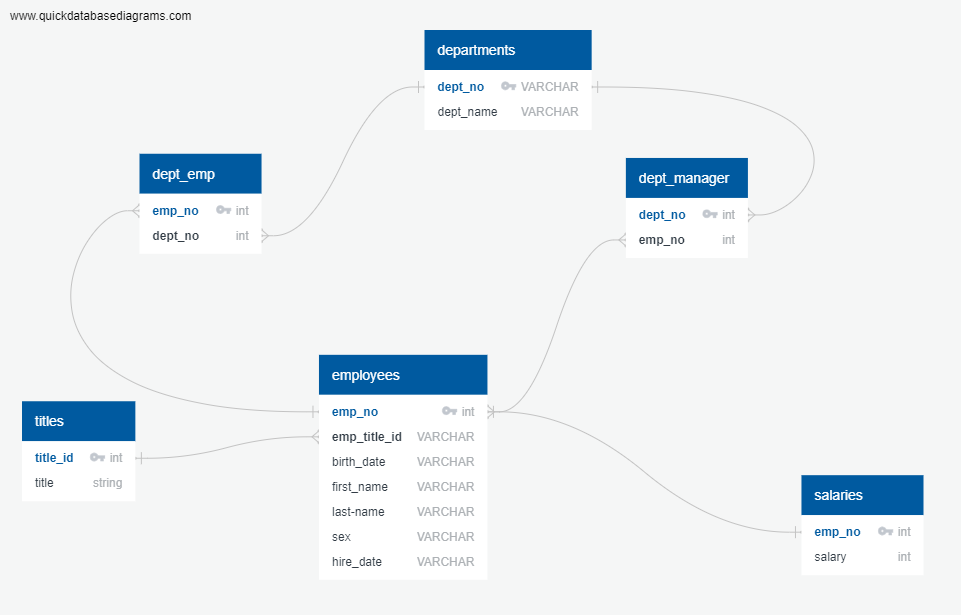

# Sql-challenge
### Background
*This is a research project on employees of a corporation from the 1980s and 1990s. 
*Six CSV files files were provided for the analysis

### Required 
*Design the tables to hold data in the CSVs
*Import the CSVs into a SQL database, and 
*Answer questions about the data. 

### Data Modeling
Inspect the CSVs and sketch out an ERD of the tables.
The ERD:

Resource: http://www.quickdatabasediagrams.com/

#### Data Analysis
Required information:

1. List the following details of each employee: employee number, last name, first name, gender, and salary.

2. List employees who were hired in 1986.

3. List the manager of each department with the following information: department number, department name, the manager's employee number, last name, first name, and start and end employment dates.

4. List the department of each employee with the following information: employee number, last name, first name, and department name.

5. List all employees whose first name is "Hercules" and last names begin with "B."

6. List all employees in the Sales department, including their employee number, last name, first name, and department name.

7. List all employees in the Sales and Development departments, including their employee number, last name, first name, and department name.

8. In descending order, list the frequency count of employee last names, i.e., how many employees share each last name.